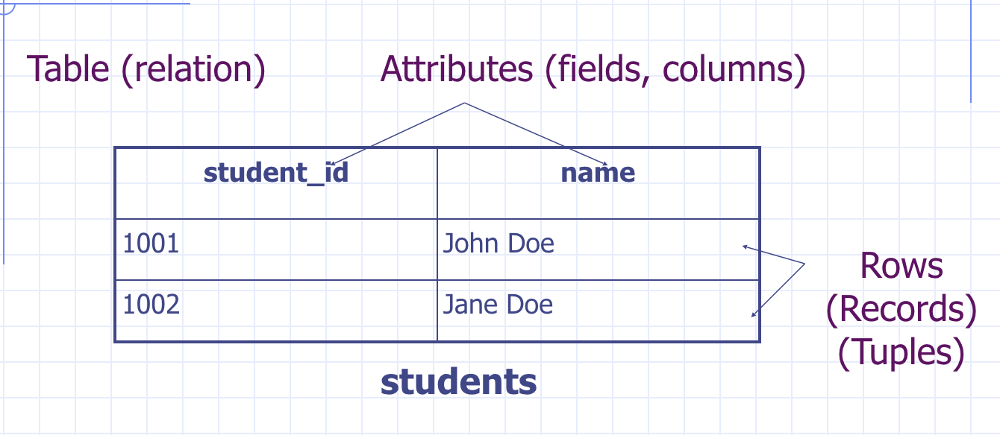

# Database (MySQL)

## Agenda

### Lecture

* MySQL recap
* Database Connector
* Database access object
* Mock testing

### Lab

* Set up MySQL
* SQL Scripts (Create, read, update, delete)
* Store information in database

## Database in Architecture


We have learned how to use back end technology with Java Servlet and JSP to
display data from the backend server. However, after a server restart, your data
is not persisted anyway. In other word, your data will be reset to the data state
that you set at the `init` method.

In this lecture, we will learn how to set up database so that our data doesn't
get lost at server restart. In additional, we will ensure the data is stored in
efficient way by using known DBMS like MySQL.

## Database Terminology

### DBMS

**DBMS** (Database Management System) is a software that manages database.

There are some known DBMS out there:

* Commercial -- Oracle, MS SQL Server, MS Access 
* Open source -- MySQL, PostgreSQL

#### Database and Schema

* A **database** is a collection of data managed by DBMS.
* In MySQL, sometimes database is also called **schema**.
* A database usually contains a number of objects (aka. schema elements) such as
indexes, stored procedures, and so on.

### Table

* **Table** represents relation
* **Attributes** represents fields or columns



## SQL

SQL stands for Structured Query Language. And it's a standard query language used
for relational database. Most of all, it's supported by all major databases with
some variants.

### SQL Script

SQL script on the other hand is a text file contains SQL statements and comments.

* Statements: `select`, `insert`, `create`
* Comments: `--` for line comment or `/* */` for block comments

> Usually uses the ".sql" suffix.

### MySQL

Very popular in web development due to few reasons:

* Open source
* Very fast search
* Full text indexing and search
* Developer-friendly features
    * `drop table if exists`
    * `insert ... on duplicate key`
    * `/* */`
    * ...

> A side note on MySQL runtime on CS3 server. It's using version 5.7. And you have
one database per account.

### Client-server architecture of MySQL


## MySQL Setup

See https://github.com/csula/Utilities/blob/master/setups/mysql.md for setting up
MySQL.

> Please note that you also have a remote CS3 server you can connect to using the
same username and password I gave to you earlier.

### Run SQL Scripts

* Command line client:
    * . path/to/script.sql
    * source path/to/script.sql;
* MySQL Workbench
    * SQL Editor -> File -> Open SQL Script -> Execute

## Schema Design Example

We will be using Employee and Project as starting example:

```java
public class Employee {
    Integer id;
    String firstName;
    String lastName;
    String address;
    Employee supervisor;
}

public class Project {
    Integer id;
    String name;
    Employee leader;
    Set<Employee> members;
}
```

### Simple Schema Design Rules

| Object Oriented | Relational Database |
| :-- | :-- |
| Model Class | Table |
| Class variables | Attributes |
| Java types | SQL Types |
| Object References | IDs |
| Collection | New Table (possibly) with references back to parent table |

### Create table

Example of create table syntax can be found below:

```
/*
CREATE TABLE table_name (
    field_name field_types [constraint(s)],
    field_name field_types [constraint(s)],
    ...
);
*/

CREATE TABLE employees (
    id INTEGER AUTO_INCREMENT PRIMARY KEY,
    first_name VARCHAR(255) NOT NULL,
    last_name VARCHAR(255) NOT NULL,
    address VARCHAR(255),
    supervisor_id INTEGER REFERENCES employees(id)
);
```

* Field types:
    * integer, float, double, char(n), varchar(n)
    * date, time, datetime, timestamp
* auto_increment
* Integrity constraint
    * unique, not null, primary key
    * foreign key

### Naming Conventions

* Use plural form for table names
* Use singular form for column names
* Use underscore to concatenate multiple words, e.g. `employee_name`

> Don't use mixed cases in names (e.g. ArtistName) because many DBMS treat names
as case-sensitive

### Create operation

Lets start by looking at some examples that will populate data into table:

```sql
// INSERT INTO ... VALUES ...
INSERT INTO table_name VALUES (value1, value2);

INSERT INTO table_name (field_name, field_name) VALUES (value1, value2);

// if you want to insert multiple rows:
INSERT INTO table_name (field_name, field_name) VALUES (value1, value2), (value1, value2);
```

### Read operation

```sql
SELECT field_name(s) FROM table_name(s) WHERE condition(s);
```

### Update operation

```sql
UPDATE table_name SET field_name=value [,...]
WHERE condition(s);
```

### Delete operation

```sql
DELETE FROM table_name WHERE condition(s);
```

### Drop tables

```sql
DROP TABLE table_name:
DROP TABLE IF EXISTS table_name;
```

