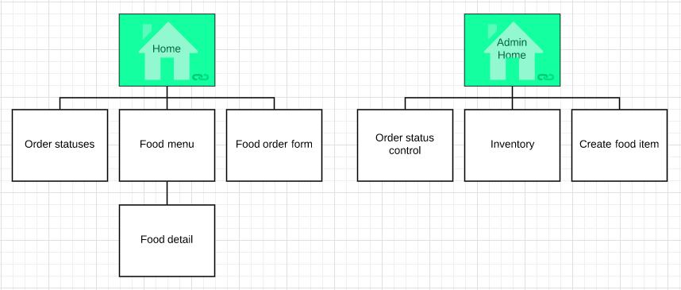
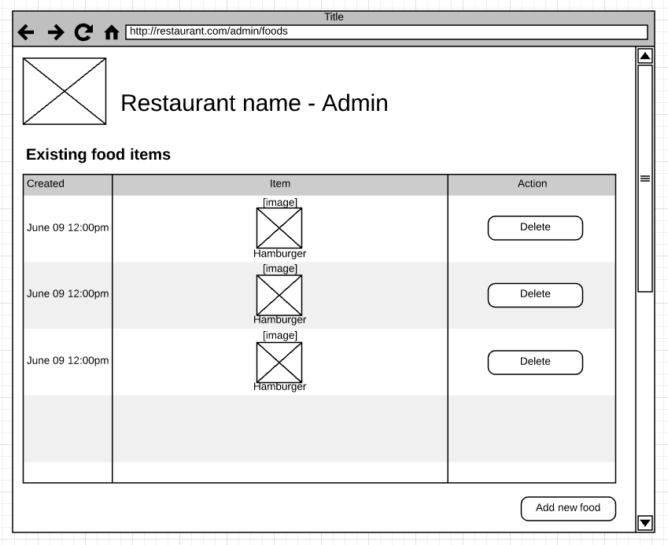
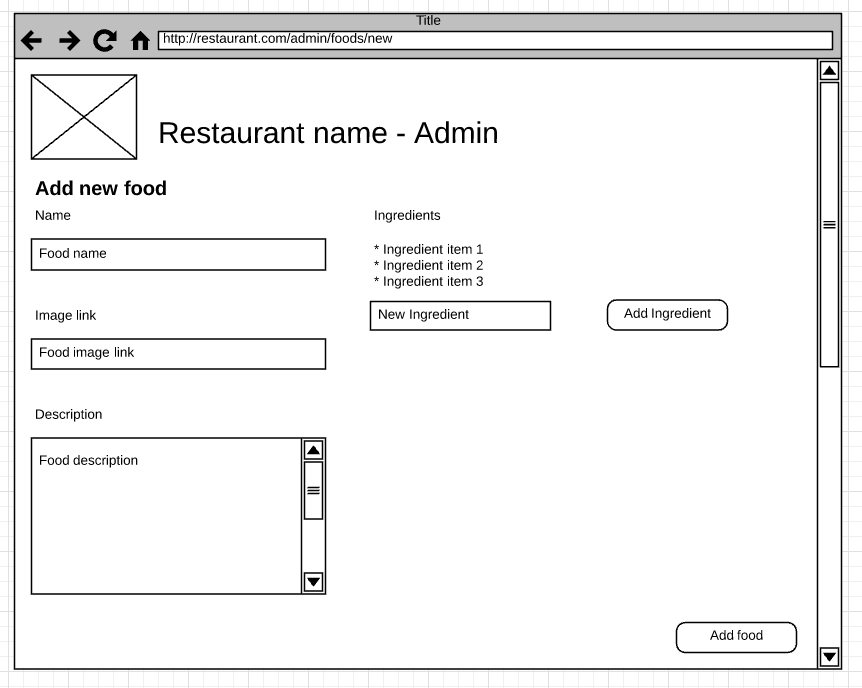

# Homework 1

## Deliverables

* Create-food-item.html
* Inventory.html
* Inventory component
* Menu component
* Create food component
* updated app.js
* Pushes changes to Github pages
* CSNS file showing URL of Github pages & Github pull request

Example CSNS file format:

```
Application URL:
https://csula-students.github.io/cs-3220-summer-2017-rcliao/

Github Pull Request URL:
https://github.com/csula-students/cs-3220-summer-2017-rcliao/pull/1
```

## Description

Continue where we left over from lab1 and lab2, we want a fully working
front-end application that can do the food ordering as well as the admin
control for the restaurant application.

Sitemap can be found below:



New pages needed on top of lab 1 and 2 can be found below:




## Requirements

All buttons and forms on the page should be working with proper style. In
example, if user click on add food item to cart, cart should show the
correct items. When user orders the item, it should show up under the
statuses.html.

In detail:

* User should be able to create new food item from create-food-item form
* User should be able to see inventory list
* User should be able to remove food item from inventory page
* User should be able to see updated food menu after adding/removing food from inventory

> Note that all the functionality (behavior) should be done in JavaScript

## Instructions


