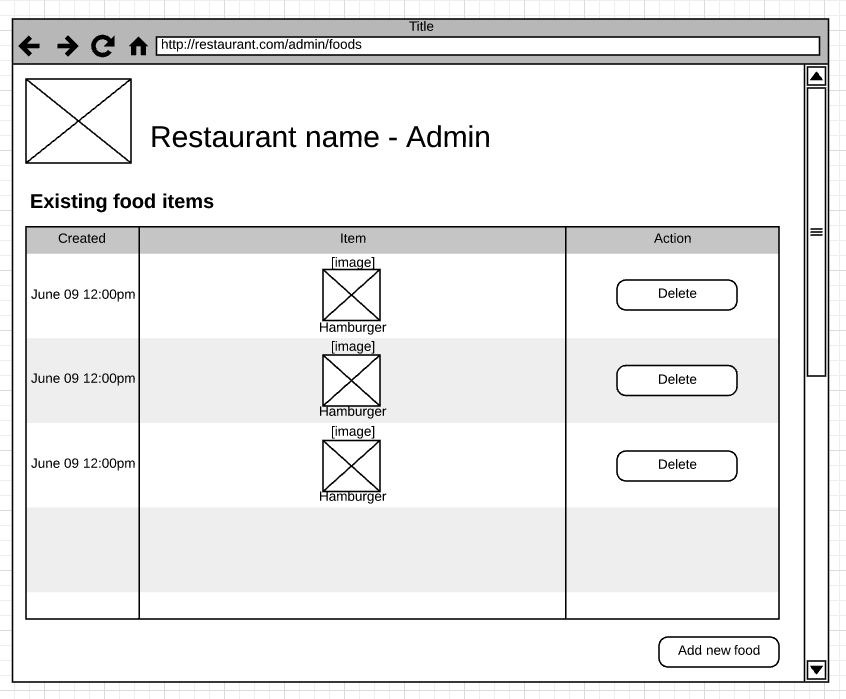
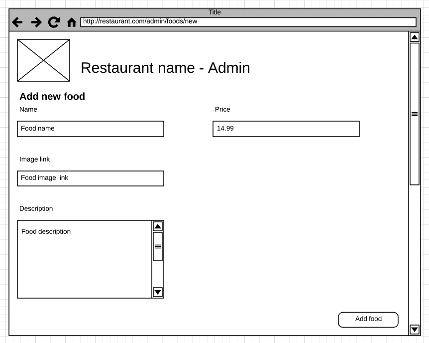

# Lab 4

## Deliverables

* Deploy to CS3 server
* admin/inventory.jsp
* admin/create-food.jsp
* admin/order-statuses.jsp
* app.css

## Descriptions

Your job here is to refactor the existing restaurant application into using JSP/JSTL.
We will start the refactoring by the admin site changes. These includes:

* inventory page
* create food form page
* control order statuses page

If you don't recall what those pages are, here is the refresher:

## Requirements

* Functional requirements stays the same as before:
	* Admin should be able to create new food from the create food form
	* Admin should be able to see its food inventory from the inventory page
	* Admin should be able to adjust the order statuses from the order-statuses
* Technical requirements:
	* All presentation logic should be done in JSP.
	* No processing is allowed in JSP
	* Request should be sent to controller and not to JSP directly
	* Servlets should not generate HTML output

